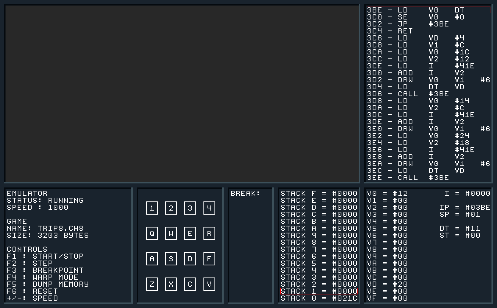

# Cross-Platform Chip-8 Emulator 



## About
This program emulates the Chip-8 interpreter which was originally a part of the RCA COSMAC VIP home computer. The emulator is written in modern C++, is highly portable and comes with a lot of additional functionality. You can compile it directly on Windows, Ubuntu and MacOS (all x86_64) with the provided CMake system. I have validated the compilation on MSVC++, g++ and Clang. Besides the x86_64 platform I have also tested it on a proprietary arm64 system with Linux and it worked perfectly. With a little bit of work it should also run on Android, iOS and the Nintendo Switch. The only real requirement is that the operating system supports SDL2 which is used for the purposely retro looking user interface.

## Features
 - Drag’n’Drop games to load them
 - Start and stop the emulation
 - Single step through the code
 - Changeable emulation speed
 - Automatically load the best speed for the included games
 - 60Hz display refresh like the real Chip-8
 - Disassembled code with highlighting
 - Register and stack view
 - Input visualization
 - Breakpoint functionality
 - Dump current memory
 - Working sound
 - Warp mode
 - Reset
 - Error handling
 - Cool taskbar icon :relaxed:
 - Opcode decoding either with a switch or function pointer table (separate branch)

## Programs
I have included 23 games, demos and test programs which I have collected over the last months. All of these programs run with the correct speed automatically. Unfortunately, I don't know who created these programs so I can't give any credits. 
Some programs you can find on the internet won't work like expected. The reason for that is that a few opcodes did get implemented differently over the last decades and these programs rely on that. To get a game like that working you have to change the source code of these instructions which isn't a problem because I also provide the alternative implementations. They are just commented out.

## Building from source
Follow the specific instructions for your platform after you have downloaded the project. Keep in mind that you can download two different versions. The only difference between them is the opcode decoding step.

### Linux/MacOS
Install the SDL2 headers, libraries and CMake. On Ubuntu you can use the apt package manager for this, on MacOS you can use [Brew](https://brew.sh/) or [MacPorts](https://www.macports.org/).
```
  # Ubuntu
  $ sudo apt install libsdl2-dev
  $ sudo apt install cmake
  
  # MacOS Brew
  $ sudo brew install SDL2
  $ sudo brew install cmake
```
Start the `build.sh` script to create the executable.
```
  $ ./build.sh
```
The executable will be placed in your build folder. To start it you have to pass the game as a parameter.
```
  $ ./build/chip8 data/games/Trip8.ch8
```

Please make sure that your data folder is in the same directory as the executable if you move it around.

### Windows
The build system expects the SDL2 headers and libraries in the subfolder `extern/SDL2-2.0.12`. If you have Python installed, you can download and extract everything by executing the Python script `setup-win32.py`. Otherwise you have to [download](https://www.libsdl.org/download-2.0.php) and extract the SDL2 development libraries by hand.

To install CMake you have to download the installer from the [official website](https://cmake.org/download/) and install it yourself.

After you have installed everything you have to run the `build.sh` script with a terminal. To start the program you need to search for the executable in your build folder. It depends on your compiler where exactly it is. You have to start the program with a terminal and pass a game as a parameter. Make sure that the data folder is in the same directory as the executable.

## To-do
 - Implement proper scaling for the user interface.
 - Implement Super-Chip-8 opcodes.
 - Port the project to an exotic system like the Nintendo Switch.
 - Multithreading (one emulation thread, one user interface thread)

## External display
Some day I thought it would be pretty cool to see the emulator output on an external display. The Chip-8 display has a resolution of 64x32 so it fits perfectly on these 64x32 RGB LED panels you can buy. So I ordered one and an Arduino Mega to control it. After tinkering around with it for a few hours I had implemented a really simple serial protocol for the communication between the Arduino and my PC. The emulator sent the changed pixels at each screen refresh over the serial connection and the program on the Arduino used that serial data to control the pixel matrix. Because the implemented serial communication was only usable with Linux and the whole solution wasn't really user friendly either, I don't provide code for that. It was just a little side project. If you are interested in how it looked like take a look at `externalDisplay.jpg`.

## References
 - [Mastering Chip-8](http://mattmik.com/files/chip8/mastering/chip8.html) by [Matthew Mikolay](https://github.com/mattmikolay)
 - [Chip-8 Wiki](https://github.com/mattmikolay/chip-8/wiki) by [Matthew Mikolay](https://github.com/mattmikolay)
 - [Chip-8 Emulator in Go](https://massung.github.io/CHIP-8/) by [Jeffrey Massung](https://github.com/massung)
 - [RCA COSMAC VIP CDP188711 Instruction Manual](http://bitsavers.org/components/rca/cosmac/COSMAC_VIP_Instruction_Manual_1978.pdf) by [RCA Corporation](https://de.wikipedia.org/wiki/Radio_Corporation_of_America)

 ## Thanks to
 - [Matthew Mikolay](https://github.com/mattmikolay) for his Chip-8 documentation.
 - [Jeff Preshing](https://github.com/preshing) for his open source CMake SDL2 [base project](https://github.com/preshing/CMakeDemo).
 - [Jeffrey Massung](https://github.com/massung) for his SDL2 user interface design idea.
